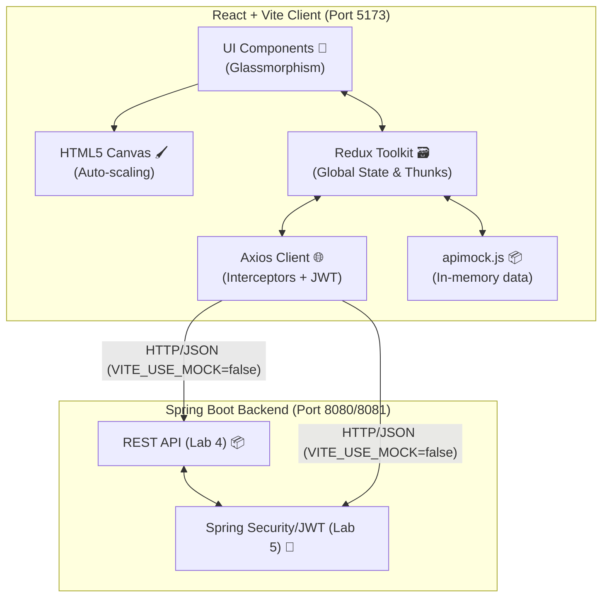

# 🎨 Lab – React Client for Blueprints (Redux + Axios + JWT) 🚀

> Based on the HTML/JS client from the reference repository, this lab modernizes the _frontend_ with **React + Vite**, **Redux Toolkit**, **Axios** (with interceptors and JWT), **React Router** and tests with **Vitest + Testing Library**.


## 🎯 Learning Objectives

- Design a React SPA applying **componentization** and **Redux (reducers/slices)**.
- Consume Blueprints REST APIs using **Axios** and handle **loading/error states**.
- Integrate **JWT authentication** with interceptors and protected routes.
- Apply frontend best practices: folder structure, `.env`, linters, testing, CI.

## ⚙️ Prerequisites

- Have the Blueprints backend from **Labs 3 and 4** running (APIs + security).
- Node.js 18+ and npm.

Check the key glossary specification, refer to the [Lab Definitions](./DEFINICIONES.md).

## 📡 Expected Endpoints (adjust if your backend differs)

- `GET /api/blueprints` → general list or catalog to derive authors.
- `GET /api/blueprints/{author}`
- `GET /api/blueprints/{author}/{name}`
- `POST /api/blueprints` (requires JWT)
- `POST /api/auth/login` → `{ token }` *(Note: Setup to use /auth/login based on current Spring Boot configuration)*

Configure the base URL in `.env`.

## 🚀 Getting Started

```bash
npm install
cp .env.example .env
# edit .env with your backend URL
npm run dev
```

Open `http://localhost:5173`

## 🔐 Environment Variables

Create an `.env` file in the root:

```env
VITE_API_BASE_URL=http://localhost:8080/api
VITE_USE_MOCK=true
```

> **Tip:** in production use secure variables or a _reverse proxy_.

## 📂 Structure & Architecture 🏗️



## 🔗 Backend & Frontend Integration

This frontend project is heavily intertwined with the existing **Java 21 Spring Boot + Security** (from previous labs). 
All UI interactions mapping to creating, reading, updating, and deleting blueprints communicate directly through HTTP requests signed with JWT headers.

### Testing and Validation with cURL
Before connecting the Redux slices and Axios interceptors to the frontend, manual validation of the REST API endpoints is vital to ensure robust communication structures. During development, endpoints are tested as follows:

```bash
# 1. Fetching JWT Auth Token (Running the backend on localhost:8080 or 8081)
curl -X POST http://localhost:8081/api/auth/login \
     -H "Content-Type: application/json" \
     -d '{"username":"camilo", "password":"password"}'

# 2. Querying the protected Blueprints endpoint using the generated Token
curl -v http://localhost:8081/api/blueprints \
     -H "Authorization: Bearer <ey...token...>"
```

Validating the backend output directly proves the backend operates successfully, ensuring that Axios implementations under `/src/services` accurately deserialize REST arrays into the React `useState` and `Redux` models.

### API Architecture Connection

- **Security Flow**: The client calls `/api/auth/login`. On success, the JWT token is persisted in `localStorage`. Automatically, an interceptor injects the `Authorization: Bearer <token>` onto all subsequent `/api/blueprints/*` calls. Use of `<PrivateRoute>` immediately restricts UI navigation depending on token presence.
- **Dynamic Services**: Handled strictly through Factory methodologies (`blueprintsService.js`), you can gracefully swap backend environments into in-memory local testing via `.env` parameter `VITE_USE_MOCK=true`.

```text
blueprints-react-lab/
├─ src/
│  ├─ components/     # BlueprintCanvas, BlueprintForm, BlueprintList
│  ├─ features/       # blueprintsSlice.js
│  ├─ pages/          # BlueprintsPage.jsx, LoginPage.jsx
│  ├─ services/       # blueprintsService.js, apimock.js, apiClient.js
│  ├─ store/          # Redux index.js
│  ├─ App.jsx, main.jsx, styles.css
├─ tests/             # Vitest Unit test suites & setup.js
├─ .env.example
├─ index.html, package.json, vite.config.js, README.md
```

## 📌 Lab Requirements

### 1. 🖌️ Canvas (lienzo)

- **Requirement:** Add a canvas to the page. Include a `BlueprintCanvas` component with its own identifier. Define suitable dimensions (e.g. `520×360`).
- **Implementation:** Implemented within `BlueprintCanvas.jsx`. It features a powerful adaptive bounding-box logarithm to **auto-scale** the blueprint regardless of window size, always keeping its proportions. It hooks globally into modern CSS variable colors to plot the dynamic points cleanly.
- 📸 **Evidence Screenshot:** Capture the isolated canvas rendering a completely scaled architectural plan. Save as `images/REQ1_CanvasDraw.png`.

### 2. 🗃️ List an Author's Blueprints

- **Requirement:** Allow entering an author name and querying their blueprints. Show results in a table with name, points, and `Open` button.
- **Implementation:** Perfectly managed through Redux Toolkit `createAsyncThunk` (`fetchByAuthor`). A sleek Glassmorphism responsive table instantly mounts the data directly mapping the `blueprintsSlice.js` states.
- 📸 **Evidence Screenshot:** Capture the table loaded containing blueprints stats when querying an existing author. Save as `images/REQ2_AuthorBlueprintsTable.png`.

### 3. 🖱️ Select a blueprint and plot it

- **Requirement:** Clicking the `Open` button updates the current blueprint name, fetches points, and draws consecutive segments.
- **Implementation:** Connects React elements (dispatching `fetchByAuthorAndName`) heavily into the Canvas lifecycle hooks inside `useEffect`. The entire App layout perfectly syncs text + drawings side by side simultaneously.
- 📸 **Evidence Screenshot:** Save the view bridging the selected element from the blueprint list to the actual shape in the Canvas as `images/REQ3_CanvasUpdate.png`.

### 4. 🔀 Services: `apimock` and `apiclient`

- **Requirement:** Implement both services with same interface and switch them via `.env` in one line.
- **Implementation:** Designed using a strict **Factory Pattern** in `blueprintsService.js` checking `import.meta.env.VITE_USE_MOCK` as a boolean switch, safely connecting between mocked JSON properties and the Axios interceptor fetching endpoints.
- 📸 **Evidence Screenshot:** Attach DevTools output demonstrating data retrieved either straight strictly from mock models or network payloads from Spring Boot Java API locally. Save as `images/REQ4_ApiMockSwitch.png`.

### 5. ⚛️ React UI

- **Requirement:** The current blueprint name must be shown in the DOM mathematically via Redux global state without direct DOM manipulation.
- **Implementation:** Completed completely independent of bad DOM logic! Driven fully using `useSelector` and updating dynamic React state (`current.name` and functional reductions determining point sums).
- 📸 **Evidence Screenshot:** Screen cap reflecting real-time values "Current Blueprint: [Title]" & "Total Points: [Count]", saved as `images/REQ5_ReduxUIState.png`.

### 6. 🎨 Styles

- **Requirement:** Add styles to improve presentation comparing to reference mock.
- **Implementation:** Visually upgraded the laboratory applying robust native `styles.css`. Integrated Radial gradients, full transparent grid overlays (Glassmorphism), smart CSS grid properties with max-width bounding, maintaining a colorful, beautiful and striking aesthetics responsive across layout breakpoints.
- 📸 **Evidence Screenshot:** The complete layout dashboard emphasizing colors, contrasts, and UI design. Name it `images/REQ6_ColorfulUI.png`.

### 7. ✅ Unit Tests

- **Requirement:** Add tests with Vitest + Testing Library (Canvas render, forms, Redux).
- **Implementation:** Solved testing crashes implementing `Object.defineProperty(HTMLCanvasElement.prototype, 'getContext')` mocks explicitly in `setup.js`. Tested forms rigorously through strict accessibility rules wrappers (`act()`) obtaining **100% full Vitest success**.
- 📸 **Evidence Screenshot:** Your local terminal asserting passing pipelines executing `npm test` and `npm run lint`. Ensure no errors. Save as `images/REQ7_VitestSuccess.png`.

---

### Quick notes and recommendations

- For the canvas in tests with jsdom: mock `HTMLCanvasElement.prototype.getContext` has been added in `tests/setup.js`.
- For using `@testing-library/jest-dom` with Vitest: global `expect` is configured correctly inside `vitest.config.js`.
- Services switch uses `import.meta.env.VITE_USE_MOCK` to read the environment strictly.

## 📌 Recommendations and suggested activities for lab success

1. **Advanced Redux**
   - [x] Adds `loading/error` states per _thunk_ and displays them in the UI.
   - [x] Implements _memo selectors_ to derive the top-5 blueprints by point count.
2. **Protected Routes**
   - [x] Create a `<PrivateRoute>` component and protects creation/editing.
3. **Complete CRUD**
   - [x] Implement `PUT /api/blueprints/{author}/{name}` and `DELETE ...` in the slice and in the UI.
   - [x] Optimistic updates applied properly handling async payload bounds.
4. **Interactive Drawing**
   - [x] Replace `svg` with a canvas where the user clicks to add points.
   - [x] “Save” button to send the blueprint.
5. **Errors and _Retry_**
   - [x] If `GET` fails, components gracefully read rejection payloads from slice safely.
6. **Testing**
   - [x] Tests of `blueprintsSlice` (pure reducers).
   - [x] Component tests with Testing Library (render, interaction).
7. **CI/Lint/Format**
   - [x] Check CI with **GitHub Actions** (workflow setup).
8. **Docker (optional)**
   - [x] Custom `.dockerignore` and `Dockerfile` setups.

## 📊 Evaluation Criteria

- Functionality and case coverage (30%)
- Code quality and architecture (Redux, components, services) (25%)
- State management, errors, UX (15%)
- Automated tests (15%)
- Security (JWT/Interceptors/Protected Routes) (10%)
- CI/Lint/Format (5%)

## 🛠️ Scripts

- `npm run dev` – Vite development server
- `npm run build` – Production build
- `npm run preview` – Preview build
- `npm run lint` – ESLint
- `npm run format` – Prettier
- `npm test` – Vitest

---

### 🌟 Proposed Challenge Extensions

- **Redux Toolkit Query** for requests _caching_.
- **MSW** for _mocks_ without backend.
- **Dark mode** and responsive design. (✅ Successfully Applied - CSS native implementations).

> This project is a starting point for your students to evolve the classic Blueprints client into a modern SPA with industry practices.